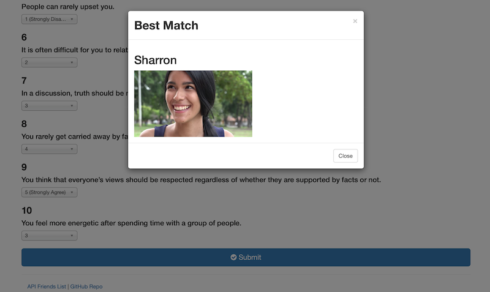

# FriendFinder

### Overview

FriendFinder is a compatibility-based dating app simulation. Using results from a compatibility quiz, you can find your closest match.

### Instructions:

1. Arriving on the landing page, click on Go to Survey to take the quiz, or click on API Friends List in order to view a JSON object containing data on each match

2. Once on the quiz, enter your first name, an URL image address. You can enter gibberish text into the image address field if you do not wish to upload a photo.

3. Answer each questions based on your opinions, using the dropdown menu.

4. Click Submit once all fields are filled out, and view your best match. The server collects information submitted to help others find a match when they take their quiz.

Created by Arvin Zojaji
Enjoy!